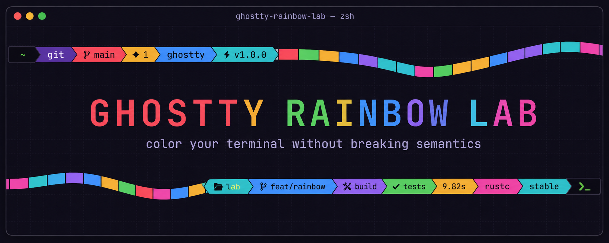
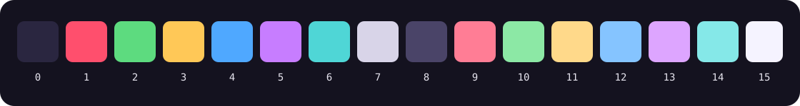
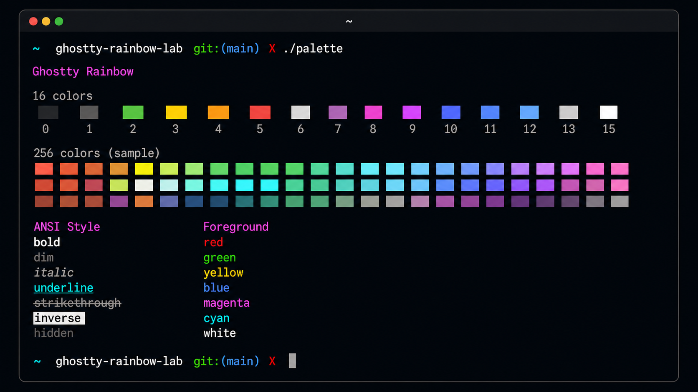
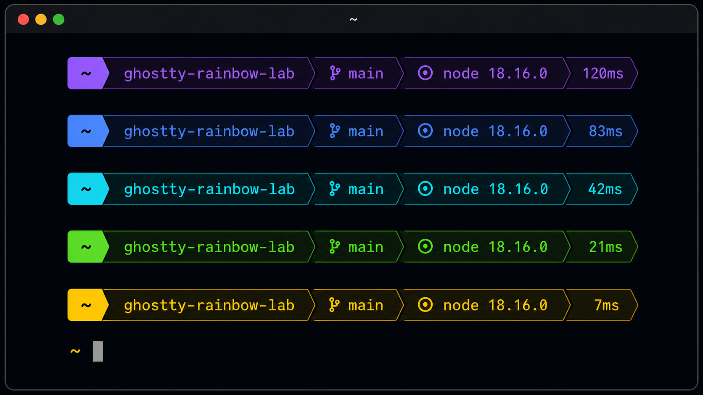
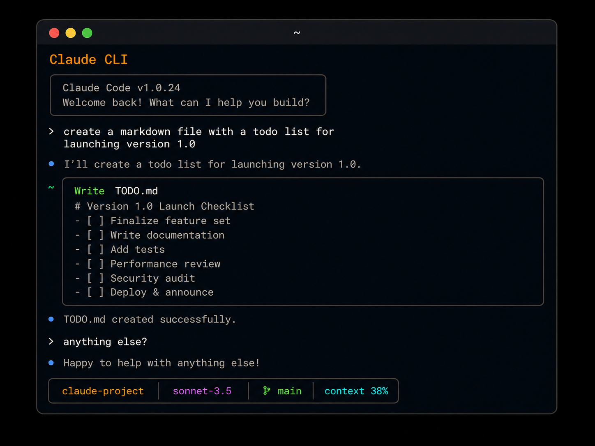

<p align="center">
  
</p>

<h1 align="center">🌈 Ghostty Rainbow Lab</h1>

<p align="center">
  A colorful macOS terminal setup for <a href="https://ghostty.org/">Ghostty</a>,
  <a href="https://starship.rs/">Starship</a>,
  <a href="https://code.claude.com/docs/en/overview">Claude Code</a>, and
  <a href="https://openai.com/codex/">Codex</a>.<br>
  Working configuration, measured behavior, and the gotchas worth remembering.
</p>

<p align="center">
  <a href="https://ghostty.org/"></a>
  <a href="https://developer.apple.com/macos/"></a>
  <a href="https://zsh.sourceforge.io/"></a>
  <a href="https://starship.rs/"></a>
</p>

<p align="center">
  <a href="#-showcase">Showcase</a> •
  <a href="#-install">Install</a> •
  <a href="#-color-systems">Color systems</a> •
  <a href="#-agent-clis">Agent CLIs</a> •
  <a href="#-gotchas">Gotchas</a>
</p>

<p align="center">
  
</p>

## 🚀 Install

```zsh
brew install zoxide lolcat eza starship
brew install figlet   # optional — useful for creating custom text banners
brew install --cask font-jetbrains-mono-nerd-font

cp -r ghostty/* ~/.config/ghostty/
mkdir -p ~/.config/starship-themes && cp starship/*.toml ~/.config/starship-themes/
cp zsh/_switcher.zsh ~/.config/starship-themes/
mkdir -p ~/.config/ghostty-rainbow-lab
cp -r zsh/greetings ~/.config/ghostty-rainbow-lab/
cat zsh/zshrc-additions.zsh >> ~/.zshrc
```

Reload Ghostty with `cmd+shift+,`.

---

## 🌈 Showcase

### Ghostty Rainbow

The custom 16-slot ANSI palette keeps semantic terminal colors readable while
giving every classic CLI tool a brighter personality.

[](https://ghostty.org/)

### Starship Prompt

Nine switchable prompt themes, including a hand-tuned powerline gradient from
purple through blue, cyan, green, and yellow.

[](https://starship.rs/)

### Claude CLI

Claude Code's status line is rendered through Starship so project, model,
branch, context, and cost feel like part of the same terminal.

<p align="center">
  <a href="https://code.claude.com/docs/en/overview">
    
  </a>
</p>

### ✨ Rainbow startup greeting

Every new interactive zsh shell opens with a colored ASCII landscape of
mountains, sunset, stars, and reflected water. [`lolcat`](https://github.com/busyloop/lolcat)
applies the truecolor gradient directly to a saved text profile, so the greeting
does not depend on an image renderer.

```text
       *                    +                 .                   *
          +              .                 *                .
       .         v  v              *              .         +
  .           *   /\                 +           *       /\             +
                 /  \    /\                       /\    /  \
       /\       / /\ \  /  \      .------.       /  \  / /\ \       /\
      /  \  ^  /  /\  \/    \   /          \    /    \/  /\  \  ^  /  \
____________|__________________/------------\___________________|___________
    -----      ----                ------                ----      -----
           ----          ---        ----        ---          ----
                   ---         --   ----    --        ---
                                     --
          --         ---           --  --           ---         --
                  --         --    --  --    --         --
```

Two profiles ship with the lab: `landscape` (the default) and your original
`poonv` banner. Switch persistently with:

```zsh
greeting-profile            # show the active and available profiles
greeting-profile poonv      # use the original poonv banner
greeting-profile landscape  # switch back to the landscape
```

## 🧪 Inside the lab

| Area | What it contains |
|---|---|
| `ghostty/` | Main Ghostty config and the custom `Rainbow` ANSI theme |
| `starship/` | Nine prompt themes, including the hand-tuned `custom` preset |
| `zsh/` | Shell additions, saved lolcat greeting profiles, and the `prompt-theme` switcher |
| `scripts/` | Palette and lolcat test harnesses with no API calls |
| `claude/` | Starship-rendered Claude Code status line |
| `codex/` | Native Codex CLI status-line and terminal-title settings |

---

## 🎨 Color systems

Terminal color is not one thing. These are independent and don't interact.

| | Mechanism | Set by | Looks like |
|---|---|---|---|
| **ANSI palette** | index `30–37` / `90–97` | `ghostty/themes/Rainbow` | one solid color per element |
| **Truecolor** | `38;2;R;G;B` | the emitting program | arbitrary RGB, gradients |
| **256-color** | index `16–255` | `palette = N=...` | xterm cube + grayscale ramp |

Programs never choose colors — they emit a **number**, and the terminal decides
what it looks like. Traced from real output:

| Program | Emits | Palette slot |
|---|---|---|
| `grep` match | `1;31` | 1 (red) |
| `git diff` removed | `31` | 1 (red) |
| `git diff` added | `32` | 2 (green) |
| `git diff` hunk header | `36` | 6 (cyan) |
| `eza` executable | `1;32` | 2 (green) |
| `eza` directory | `1;34` | 4 (blue) |

So editing `palette = 2` changes git-added lines *and* eza executables *and*
every "success" message, simultaneously. One slot, many meanings — which is why
theme design is constrained.

**To find which slot to edit:**
```zsh
<command> --color=always | cat -v | head -3   # read the ^[[NNm codes, subtract 30
```

### The startup greeting is NOT the palette

The startup greeting uses lolcat's truecolor (`38;2;R;G;B`) and bypasses the
palette entirely.
Deleting the `Rainbow` theme wouldn't change them. Same for the Starship prompt.
The palette only affects programs that emit *indexed* color.

You never see the palette as a rainbow — only one slot at a time.

---

## 🧯 Gotchas

<details>
<summary><strong>Open the field notes that cost real time to learn</strong></summary>

<br>

### `lolcat -F` depends on text length

`-F` is hue rotation **per character**, so the right value is a function of how
long the text is. There is no single good value.

| `-F` | 43-char line | paragraph |
|---|---|---|
| 0.02 | one solid color | one full rainbow ✓ |
| 0.05 | one solid color | broad bands |
| 0.3 | one full rainbow ✓ | tight noisy bands |

Setting `-F 0.05` on a short greeting produced **solid green** — technically a
gradient from `rgb(65,254,63)` to `rgb(147,227,9)`, visually one color.

Count the **line** length, not the block length. A `figlet` banner looks like a
paragraph but its rows are short — the `smslant` greeting is 5 rows of 27 chars,
so it belongs in the 43-char column and wants `0.3`, not `0.02`. At `0.3` each
row sweeps blue → cyan → green → yellow, and the per-row offset carries the
gradient diagonally down the block.

### Ghostty falls back on unknown fonts silently

Config said `JetBrainsMono Nerd Font`; the registered family is
`JetBrainsMono Nerd Font Mono`. No error, just a silent fallback. Always verify:

```zsh
ghostty +list-fonts | grep -i <name>   # unindented lines = family names
```

Same class of problem with themes — they're case- and space-sensitive
(`Catppuccin Mocha`, not `catppuccin-mocha`).

### `claude -p` costs ~$0.24 per call

Every print-mode call reloads the full plugin/skill/MCP context (~35k cache
tokens) before answering. A test loop that calls it once per color variation
costs several dollars for zero extra information.

`scripts/claude-rainbow-test.sh` makes **zero API calls** — it uses canned text
shaped like a Claude response instead.

### BSD `ls` strips color when piped

`CLICOLOR=1` only applies to a TTY. Use `CLICOLOR_FORCE=1` to verify config
through a pipe. Also: the common `LSCOLORS` string floating around the internet
maps world-writable directories to a **green background**, which looks alarming
in a folder full of cloned repos. Slots 10 and 11 here are set to match normal
directories instead.

</details>

---

## 🌈 Color without broken workflows

The rule: **decorate, never overwrite semantics.** Color that carries meaning
(diffs, file types, syntax) must stay untouched.

Safe:
- gradient prompt (starship — truecolor, independent of palette)
- rainbow greeting at shell start
- `figlet | lolcat` banners, `cal | lolcat`
- Ghostty `background-image` gradient

Not safe:
- `alias git='git | lolcat'` — destroys diff red/green
- piping interactive `claude` — wrecks TUI redraw
- `lolcat` as `$PAGER` — breaks `less` search highlighting
- `lolcat -a` in a prompt — ~1s added to every command

---

## 🤖 Agent CLIs

### Claude Code status line, rendered by Starship

<details>
<summary><strong>How the Claude Code status line works</strong></summary>

<br>

Claude Code's `statusLine` runs any command, hands it session JSON on stdin, and
prints stdout in a row at the bottom of the UI. Point it at starship and the bar
matches the shell prompt — same separators, same `Rainbow` palette.

```
build-cli gateway | ████░░░░░░░░░░░░░░░░  $353.67 / $2,000.00 (17.7%) weekly
  Opus 5  ghostty-rainbow-lab   main ?  ██░░░░░░░░ 23%  $0.42
```

Line 1 is delegated to build-cli untouched; line 2 is starship. Each `echo` is a
row. Total runtime ~166 ms, of which ~127 ms is the build-cli call.

`$directory`, `$git_branch`, `$git_status` come free — the script `cd`s to
`workspace.current_dir` and starship's own modules do truncation, repo
detection, and dirty-state glyphs. Claude-only data (model, context, cost)
arrives as `env_var` modules, so it is styled in TOML like any other segment.

Truecolor, so it is independent of the palette — same category as the prompt.

Install the Claude statusline helper with:

```zsh
cp -r claude ~/.config/ghostty-rainbow-claude   # or run it from the repo
```

Then set `statusLine.command` in `~/.claude/settings.json` to that
`statusline.sh`, keeping `refreshInterval` so the budget line stays current
while the session is idle.

</details>

### Codex CLI status line

<details>
<summary><strong>How the native Codex status line differs</strong></summary>

<br>

Codex CLI has a native, fixed-item status line rather than Claude Code's
external command hook. The checked-in config selects model/reasoning, project,
branch, run state, and context usage, with Codex's own syntax-theme colors:

```zsh
mkdir -p ~/.codex
cp codex/config.toml ~/.codex/config.toml
```

If `~/.codex/config.toml` already exists, copy the `[tui]` settings into it
instead of replacing the file. Restart Codex after changing the config.

As of the current CLI, arbitrary Starship output and custom ANSI status-line
commands are not supported, so the Claude statusline script cannot be reused
inside Codex's TUI. Codex's native `terminal_title` setting does work with this
setup because Ghostty's competing shell title hook is disabled.

</details>

### Claude status-line gotchas

<details>
<summary><strong>Starship environment, context gauges, and build-cli ownership</strong></summary>

<br>

**`starship init zsh` exports `STARSHIP_SHELL=zsh`, and the script inherits it.**
starship then wraps output in zsh's non-printing markers and doubles every
literal `%`. Claude Code is not zsh, so it prints raw:

```
%{[38;2;199;125;255m%}  Opus 5 ... ██░░░░░░░░ 23%%
```

`unset STARSHIP_SHELL` before `starship prompt` fixes both symptoms.

**starship skips an `env_var` module only when the variable is *unset*.**
`export CC_CTX_WARN=""` still renders the format string. The context gauge uses
three mutually exclusive vars for its green/yellow/red bands (starship has no
conditionals), so the two inactive ones must be `unset`, not set to empty —
otherwise they emit stray colored spaces after the bar.

**`git_status` renders its format inside a repo even with no glyphs to show.**
A bare trailing space to clear the powerline separator therefore leaks a stray
space on every clean tree. Use a group — `[($all_status$ahead_behind )]` —
which starship drops entirely when all variables inside are empty.

**build-cli owns its statusline script.** `~/.config/build-cli/statusline.sh` is
marked auto-generated and is overwritten by `build-cli claude setup`, which also
repoints `statusLine.command`. `build-cli config set statusline_disabled true`
is the documented escape hatch; without it, the next setup run silently reclaims
the bar. The wrapper calls the `build-cli` binary directly rather than that
generated script, and drops the line cleanly if the binary is missing.

Two things that are easy to assume wrong about that flag, both measured:

- It does **not** silence `build-cli claude statusline`. With the flag on, the
  command still exits 0 and prints its 76 bytes, so line 1 survives. The flag
  gates only what `setup` *writes*, not what the binary *prints*.
- It is not immediate — it reports `Run 'build-cli claude setup' to apply`. It
  is a standing guard against the next setup, not a change you can observe now.

Setting it touches `~/.config/build-cli/config.json` only. Verified by checksum
that `~/.claude/settings.json` and the generated script are both left alone, so
enabling it cannot clobber a `statusLine.command` you have already repointed.

</details>

## 🤖 Agent-driven shells

Claude Code exports `CLAUDECODE=1`, `CLAUDE_CODE_ENTRYPOINT`, and
`CLAUDE_CODE_SESSION_ID`, and interactive shells it spawns inherit them. The
marker goes in the **tab title**, not the prompt:

```
󰚩 …/Repos/ghostty-rainbow-lab      agent-driven tab
…/Repos/ghostty-rainbow-lab        normal tab
󰚩 git rebase -i main               while a command runs
```

<details>
<summary><strong>Why the marker lives in the tab title, plus testing details</strong></summary>

<br>

### Why the title and not the prompt

- **A tab is the thing being disambiguated.** With `macos-titlebar-style = tabs`
  the title is already in the tab bar. A prompt marker only exists at a prompt:
  it scrolls away, and it never appears during agent tool calls at all, because
  those run non-interactively with `PS1` unset.
- **starship has no include mechanism.** `starship config` edits single keys;
  there is no `include`/`extends`. A prompt marker is orthogonal to theme
  choice, so putting it in themes means duplicating and recolouring it across
  all nine, and remembering it for every new one.
- Costs nothing per prompt, and survives `prompt-theme` switching.

### Ghostty's title feature has to be turned off

The two cannot cooperate. Ghostty's integration registers
`_ghostty_deferred_init` as a precmd and only defines `_ghostty_precmd` when
that *first fires* — after `~/.zshrc` has finished. So at rc time there is no
function to append to, and the integration deliberately forces its own hook to
the end of `precmd_functions` (its comment: "We'll break them as much as they
are breaking us"). Hence `title` is dropped from `shell-integration-features`
and `zshrc-additions.zsh` reimplements both behaviours it provided — cwd at the
prompt, running command during execution — in six lines.

**`shell-integration-features` is additive over the defaults — omitting a
feature does not disable it.** Rewriting the line as `cursor,sudo` looks like it
drops `title`, and it silently does nothing: the effective value stays

```
cursor,sudo,title,no-ssh-env,no-ssh-terminfo,path
```

Disabling needs the `no-` prefix — `cursor,sudo,no-title`. This is invisible
from the config file and produced no error or warning; the symptom was a new tab
still reporting `title` in `$GHOSTTY_SHELL_FEATURES` after a clean reload, which
looks like the reload failing rather than the setting being a no-op.

The file is not the authority. Check what Ghostty actually parsed:

```zsh
ghostty +show-config | grep shell-integration
```

`cmd+shift+,` is enough to apply it — no app restart. Worth stating because the
additive-flags trap makes it look otherwise: the setting appears not to reload,
when in fact it reloaded a value that had not changed. Confirm in a **new** tab,
since existing shells keep the hooks they started with. A correct result reads
`cursor:steady,path,sudo` — `no-title` shows up as absence, not as an entry.

Same reason the runtime value never matches what you wrote: `cursor` is reported
as `cursor:steady`, and `path` appears from the defaults regardless.

### Seeing it

In a **new** tab — existing ones keep the hooks they started with:

```zsh
CLAUDECODE=1 zsh -i    # title gains the marker; `exit` reverts it
```

With a single tab there is no tab strip and the title sits in the window
titlebar instead; `cmd+t` gives you a strip to compare across.

A tab showing the plain directory proves nothing on its own — Ghostty's built-in
`title` renders that too, so both implementations look identical at rest. Tell
them apart by the truncation shape (this one emits `…/` plus the last three
segments) or by asking `$GHOSTTY_SHELL_FEATURES` directly.

Headless testing only goes so far. Calling `_tt_precmd` / `_tt_preexec` directly
does verify the mark and the sanitisation, but `zsh -i -c 'true'` never renders a
prompt and so emits zero title writes — the prompt cycle has to be driven by a
real terminal.

### Details worth keeping

The marker `󰚩` is `U+F06A9`, in the Supplementary Private Use Area — a Nerd Font
codepoint. It renders in the tab bar only because CoreText's fallback finds
JetBrainsMono Nerd Font among the installed fonts; the tab bar itself draws in
the system UI font, which has no PUA coverage. So the marker degrades to a tofu
box — silently, while everything else keeps working — if the Nerd Font is
uninstalled, or this repo lands on a machine without it. Swap `_tt_mark` to `🤖 `
(universal coverage) or `● ` / `[cc] ` (monochrome) if that happens.

The test is `[[ ${CLAUDECODE-} == 1 ]]`, not `-n`. An empty `CLAUDECODE` must not
count — the same set-but-empty trap that bites `env_var` modules elsewhere here.

Command titles run through `${1//[[:cntrl:]]}`, as Ghostty's own does. A command
containing `\e]2;HIJACK\a` loses its `ESC` and lands in the title as inert text;
verified the output carries exactly one `ESC`, the opener.

Related: interactive shells spawned by Claude Code run `~/.zshrc` in full, so the
lolcat greeting fires on each one.

</details>

## 🧰 Commands added

| Command | Does |
|---|---|
| `z <frag>` | jump to a visited directory by fragment (zoxide) |
| `zi <frag>` | interactive picker |
| `ls` `ll` `la` `lt` `lg` | eza with icons, git status, tree |
| `prompt-theme` | list prompt themes (● = active) |
| `prompt-theme <name>` | switch (tab-completes) |
| `prompt-theme -` | revert to previous |
| `greeting-profile` | list saved greeting profiles (● = active) |
| `greeting-profile <name>` | persistently switch the startup greeting |
| `scripts/palette-test.sh` | render all 16 slots with indices |
| `scripts/rainbow-test.sh` | lolcat `-F` / `-S` / `-p` sweeps |

## ⚙️ Ghostty options worth knowing

```
palette-generate = true     # derive all 256 colors from your base 16 (1.3+)
palette-harmonious = true   # reverse generated order for light/dark parity
minimum-contrast = 1.1      # auto-bump unreadable fg/bg pairs
theme = light:X,dark:Y      # auto-switch with macOS appearance
```

`palette-generate` is off by default because legacy TUIs hardcode xterm's
256-color assumptions. Not enabled here — worth trying, easy to revert.

## 🪟 Per-window profiles

Ghostty has no profile switcher. On macOS the CLI can't launch the terminal
directly — use `open`:

```zsh
open -na Ghostty.app --args --theme=Rainbow --font-size=16
open -na Ghostty.app --args --config-file=$HOME/.config/ghostty/work.conf
```

Custom themes go in `~/.config/ghostty/themes/<Name>` and show up in
`ghostty +list-themes` tagged `(user)`.
